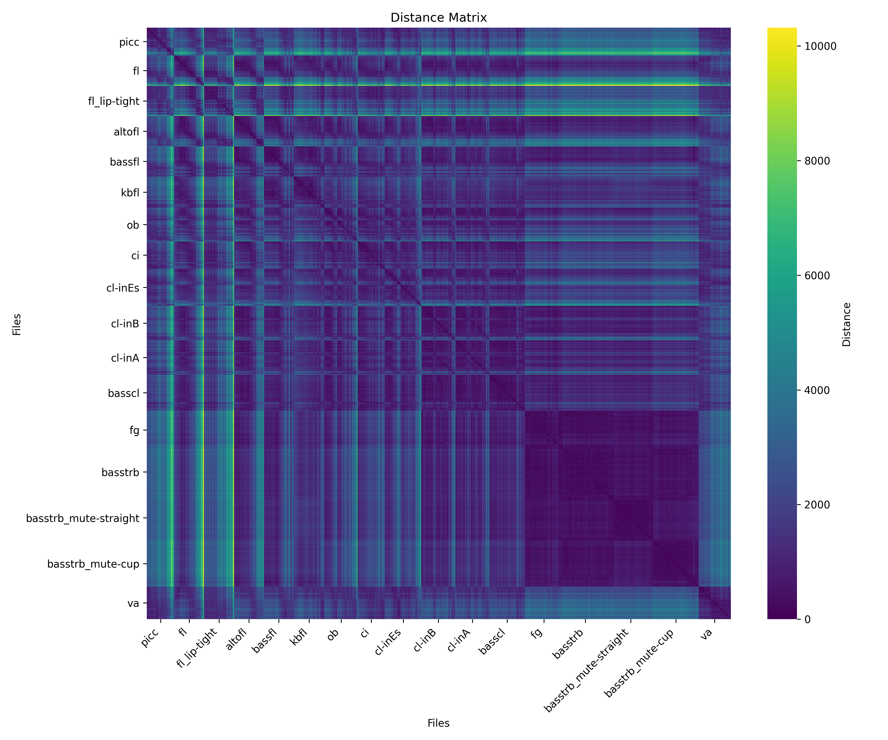

# Klangfarbenatlas

**Klangfarbenatlas** is a research dataset of chromatic longtone recordings from musical instruments, designed for Klangfarbenharmonielehre, spectral geometry, and Wasserstein-distance-based studies of musical timbre.

The dataset provides standardized recordings across the playable range of each instrument, together with accompanying analysis scripts and distance matrix generation tools. It serves as the experimental foundation for the geometric harmony framework introduced in [*Klangfarbenakkord and Klangfarbenharmonien: Metric Space Models for Music on Informational Geometry 1*](https://arxiv.org/abs/2608.28026), where instrumental timbres are modeled as elements of a metric space using Wasserstein distances.



## ✨ Features

* **24 instrument categories**, including woodwinds, brass, strings, and reference signals (expect constant updates).
* **1141 WAV recordings** covering chromatic long tones (expect constant updates).
* Standardized file naming with written pitch, concert pitch, and performance-condition metadata where applicable.
* Analysis scripts for:

  * FFT-based spectral extraction
  * L1 and L2 Wasserstein distance computation
* Precomputed distance matrices for multiple Wasserstein variants.

## 📁 Repository Structure

```
└── wav
    ├── altofl
    │   ├── altofl000_conc-G3_writ-C4.wav
Klangfarbenatlas/
├── wav/
│   ├── fl/              # Flute
│   ├── ob/              # Oboe
│   ├── cl-inEs/              # Clarinet in E♭
│   ├── cl-inB/              # CLarinet in B♭
│   ├── basscl/          # Bass Clarinet
│   ├── va/              # Viola
│   └── ...              # and more!
├── distanceMatrix_L1/
├── distanceMatrix_L2/
├── distanceMatrix_lbL1/
├── distanceMatrix_lbL2/
├── py00_wasserstein_calcDistance_FFT.py
└── py01_wasserstein_visualize_distanceMatrix_*.py

````

Each instrument directory contains chromatic longtone recordings. Some instruments additionally include alternative fingerings, mute conditions, or other performance variants.

## 🏷️ File Naming

Examples:

```
fl012_C5.wav
altofl018_conc-Cis5_writ-Fis5.wav
basstrb045_F4_ovt-06_pos-I.wav
```

Depending on the instrument, filenames may encode:

- concert pitch (`conc-*`)
- written pitch (`writ-*`)
- overtone number (`ovt-*`)
- fingering position (`pos-*`)
- mute type (`mute-*`)
- performance variant

## 🎼 Research Background

In *Harmonielehre* (1911), Arnold Schönberg proposed that musical timbre could become a structural principle of music comparable to melody itself. He envisioned **Klangfarbenmelodie** as

> “progressions whose relations with one another work with a kind of logic entirely equivalent to that logic which satisfies us in the melody of pitches.”

before adding,

> “That has the appearance of a futuristic fantasy and is probably just that. But I have absolute faith that it will come about.”

More than a century later, this "futuristic fantasy" continues to inspire composers—from Webern to Schaeffer, Stockhausen, Ligeti, and many others—yet a quantitative framework capable of connecting timbral analysis directly to composition, orchestration, and harmonic thinking has remained limited.

**Klangfarbenatlas** approaches this challenge from a different perspective. Rather than describing individual spectra in isolation, it places the measurable **difference between two timbres** at the center of analysis, treating timbral transformation itself as the primary object of study. In this perspective, geometry emerges not from isolated sounds but from the network of relations between them, providing a measurable counterpart to Schönberg's search for a logic of timbral succession.

Unlike approaches based on perceptual ratings or other cognitive variables, this project relies **exclusively on physical observables**. Each recording is decomposed into its frequency spectrum, and the normalized spectrum is interpreted as a probability density distributed along the cochlear partition. This representation is inspired by the frequency-selective filtering performed by the basilar membrane before higher-level auditory cognition. The implementation in this repository employs **FFT-based spectral decomposition** for computational efficiency and reproducibility. Although FFT is not itself the biological mechanism of the cochlea, it serves as a practical approximation of the same principle of frequency separation.

Recent developments in **Wasserstein geometry** have attracted increasing attention in information geometry, statistics, and machine learning because they endow probability distributions with a meaningful geometric structure through optimal transport. In particular, recent work associated with **Shun-ichi Amari** and collaborators has highlighted how optimal transport complements classical Fisher-information geometry, extending geometric methods for probability distributions beyond coordinate-based descriptions. Within this framework, timbral change can be interpreted as the **minimum transport cost required to transform one spectral distribution into another**, allowing musical timbres to be compared through the physical displacement of spectral energy rather than isolated spectral descriptors.

While this dataset also provides precomputed analyses using L2-Wasserstein distance and logarithmic-frequency variants, the accompanying research primarily adopts the **L1-Wasserstein distance** because it simultaneously preserves two physically meaningful properties: conservation of spectral mass and the total amount of transport required to transform one timbre into another. Instead of treating frequency bins as independent coordinates, L1-Wasserstein interprets spectral change as the cumulative displacement of acoustic energy across the frequency axis, making it particularly suitable for describing continuous timbral transformations.

For normalized spectra in one dimension, the L1-Wasserstein distance is defined as

$$
W_1(P,Q)=\int_{-\infty}^{\infty}\left|F_P(x)-F_Q(x)\right|dx,
$$

where $F_P$ and $F_Q$ denote the cumulative distribution functions of the two normalized spectra. Unlike pointwise spectral differences, this formulation preserves the total spectral probability while measuring **how much spectral mass must be transported, and how far**, to transform one timbre into another. In other words, timbral difference is represented not by isolated spectral peaks but by the minimum physical work required to rearrange the entire spectral distribution.

The accompanying research introduces a metric-space framework for **Klangfarbenakkord** and **Klangfarbenharmonie**, in which instrumental timbres become elements of a common geometric space connected by optimal transport while remaining compatible with conventional harmonic theory. By expressing timbral relationships as measurable physical distances, the framework makes it possible to identify problematic orchestral blends, quantify timbral convergence and divergence within ensembles, and support orchestration and composition inspired by the serial treatment of timbre in **Klangfarbenmelodie**, extending these ideas toward a systematic practice of **Klangfarbenharmonie**.

In this sense, **Klangfarbenatlas** is not merely a collection of recordings, but a cartography of timbral transformations—a space in which compositional decisions can be explored through measurable relationships between sounds.

## 📖 Citation

If you use this dataset, please cite the accompanying paper.

```bibtex
@misc{tamura2026klangfarbenakkord,
  title={Klangfarbenakkord and Klangfarbenharmonien Metric Space Models for Music on Informational Geometry 1},
  author={Yusei Tamura and Shigekazu Ishihara and Ken Ito},
  year={2026},
  eprint={2608.28026},
  archivePrefix={arXiv},
  primaryClass={cs.SD}
}
```

Paper: [Klangfarbenakkord and Klangfarbenharmonien: Metric Space Models for Music on Informational Geometry 1](https://arxiv.org/abs/2608.28026)

## 📖 References

1. Arnold Schönberg. *Harmonielehre*. Universal Edition, Vienna, 1911.
1. Shun-ichi Amari. *Information Geometry and Its Applications*. Springer, 2016.
1. [Yusei Tamura, Shigekazu Ishihara, and Ken Ito. *Klangfarbenakkord and Klangfarbenharmonien: Metric Space Models for Music on Informational Geometry 1*. arXiv:2608.28026.](https://arxiv.org/abs/2608.28026)
