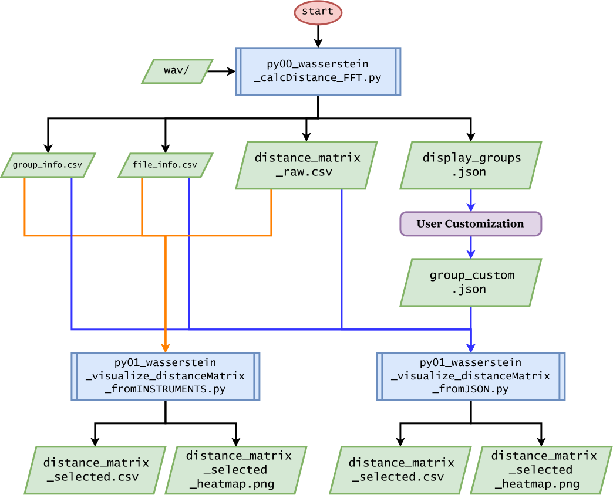

Language: English | [日本語](.readme/README.ja.md) | [Français](.readme/README.fr.md) | [Deutsch](.readme/README.de.md)

> Melodies of timbre! What refined senses are able to distinguish these, what a highly developed mind can take pleasure in such subtle things!
>
> Who would dare to demand a theory here!
>
> — Arnold Schoenberg, **Theory of Harmony** (1911)

Composer **Arnold Schoenberg** wrote the above words at the end of *Harmonielehre* (1911), published while mourning the death of his mentor and friend, the composer-conductor **Gustav Mahler**.

This challenge was confronted directly by **Alban Berg**, **Anton Webern**, and, after the Second World War, by **Luigi Nono**, **Pierre Boulez**, and **Karlheinz Stockhausen**. Yet throughout their lifetimes they were unable to establish an adequate method. In a sense, they had arrived too early for the history of science.

In the twenty-first century, however, **Shun-ichi Amari's** methods of **information geometry** (1982/85–) enable us to measure the **distance between timbres** as an exact physical quantity in hertz. From this emerge the possibility of timbral geodesics, the geometry of chords and harmony, and ultimately the realization of Schoenberg's imagined **harmony of timbre**, extending beyond conventional harmony based solely on pitch. The following sections develop this framework as an attempt to open a new chapter in the history of music.

# Atlas Enharmonic Spectra

*"Klangfarbenharmonie" — Invitation to the spectral tuning for harmonic ensembles.*

---

**Atlas Enharmonic Spectra** is a chromatic long-tone dataset of instrumental and vocal sounds, together with an information-geometric computational framework for music, designed to advance **Klangfarbenharmonie** and **Klangfarbenakkord** in ensemble practice.

In addition to standardized recordings covering the practical range of each instrument, the repository includes FFT-based spectral extraction, Wasserstein-distance computation scripts, and precomputed distance matrices. It serves as the experimental foundation for the framework introduced in [**Klangfarbenakkord and Klangfarbenharmonien: Metric Space Models for Music on Informational Geometry 1**](https://arxiv.org/abs/2608.28026), in which timbral relationships are described through optimal transport between normalized spectra.

The repository is intended as a practical support tool for composition, orchestration, and performance, allowing timbres to be compared across differences of pitch, instrument, and playing technique.


## ✨ Features

- **24 instrument categories** (woodwinds, brass, strings, reference signals, and more; continuously expanding)
- **1,141 WAV recordings** (chromatic long tones; continuously expanding)
  - Sampling rate: $f_s=96\ \mathrm{kHz}$
  - Number of samples: $N=2^{20}$
  - Standardized recording length: $N/f_s=10.922666\ldots\ \mathrm{sec}$
  - See [**Sparse FFT: A New High-Resolution Frequency Analysis and Its Applications**](https://jastice.org/2022/05/16/vol-8-2-pp-188-193-2021-2022/).
- Unified filename conventions including written pitch, concert pitch, and playing-condition metadata.
- Scripts for computing L1 and L2 Wasserstein distances between spectra.
- Precomputed Wasserstein distance matrices.

## 📁 Repository Structure

```text
atlas-enharmonic-spectra/
├── wav/
│   ├── fl/          # Flute
│   ├── ob/          # Oboe
│   ├── cl-inEs/     # Clarinet in E♭
│   ├── cl-inB/      # Clarinet in B♭
│   ├── basscl/      # Bass Clarinet
│   ├── va/          # Viola
│   └── ...          # and more!
│
├── distanceMatrix_L1/    # Precomputed L1 Wasserstein matrices
├── distanceMatrix_L2/    # Precomputed L2 Wasserstein matrices
├── py00_wasserstein_calcDistance_FFT.py
└── py01_wasserstein_visualize_distanceMatrix_*.py
```

Each instrument directory contains chromatic long-tone recordings. Some instruments additionally include alternative fingerings, mute conditions, and other performance variants.

## 🏷️ File Naming

Examples:

```text
fl012_C5.wav
altofl018_conc-Cis5_writ-Fis5.wav
basstrb045_F4_ovt-06_pos-I.wav
```

Depending on the instrument, filenames may encode:

- Concert pitch (`conc-*`)
- Written pitch (`writ-*`)
- Overtone number (`ovt-*`)
- Position or fingering (`pos-*`)
- Mute type (`mute-*`)
- Playing condition

## ▶️ Execution Procedure

Run the Python programs according to the flowchart below to generate Wasserstein distance matrices as CSV files and PNG heatmaps, depending on your objective.



## 🎼 Research Background

In *Harmonielehre* (1911), Arnold Schoenberg argued that it should become possible to create

> *"...Folgen herzustellen, deren Beziehung untereinander mit einer Art Logik wirkt, ganz äquivalent jener Logik, die uns bei der Melodie der Klanghöhen genügt."*

> *"...progressions whose relations with one another function according to a kind of logic entirely equivalent to that which satisfies us in the melody of pitches."*

At the same time, he acknowledged that this remained a vision of the future.

> *"Das scheint eine Zukunftsphantasie und ist es wahrscheinlich auch. Aber eine, von der ich fest glaube, daß sie sich verwirklichen wird."*

> *"It appears to be a fantasy of the future, and probably it is. Yet I firmly believe that it will one day become reality."*

This **Zukunftsphantasie** was inherited by many composers, including **Webern**, **Schaeffer**, **Stockhausen**, and **Ligeti**. Postwar serialism expanded organization beyond pitch to duration, dynamics, and timbre itself. Nevertheless, no method became firmly established within musical practice for treating timbre across instruments by means of a common organizing principle comparable to that of pitch.

This contrast reflects the different historical development of pitch and timbre. For pitch, mathematical descriptions evolved through **Pythagorean** frequency ratios, **Gioseffo Zarlino's** just intonation, and **Zhu Zaiyu's** mathematical derivation of twelve-tone equal temperament. At a time when music and mathematics were far less separated than they are today, these developments established shared quantitative principles for relating pitches. Yet such tuning systems describe relationships among pitches rather than relationships among timbres, and they cannot naturally account for differences between instruments or the continuous evolution of timbre during performance.

Rather than characterizing an isolated spectrum, **Atlas Enharmonic Spectra** treats **the distance between spectra** as the primary object of analysis. This constructs a timbral space from measurable relationships, quantifies Schoenberg's concept of **Klangfarbenmelodie**, and extends it toward **Klangfarbenharmonie**, providing a common basis for comparing timbral convergence and divergence in ensemble performance and supporting decisions in performance, orchestration, and composition.

---

The analysis relies exclusively on **physically observable quantities**, without incorporating perceptual ratings or subjective questionnaires. Each recording is decomposed into its frequency spectrum, and the normalized spectrum is interpreted, following **Born's probabilistic interpretation**, as a probability density function. This model is inspired by the physiological mechanism of the cochlea, in which frequency components are spatially separated along the basilar membrane before being observed by the hair cells. For reproducibility and to minimize arbitrariness, frequency decomposition is performed using the **Fast Fourier Transform (FFT)**.

In recent years, **Wasserstein geometry** has become widely used in information geometry, statistics, and machine learning as a framework that endows probability distributions with geometric structure through optimal transport. In particular, the work of **Shun-ichi Amari** and collaborators has helped establish new connections between optimal transport and information geometry, offering a new geometric perspective on probability distributions. This repository applies that framework to timbral analysis by interpreting timbral change as the **minimum transport cost required to move spectral mass from one normalized spectral distribution to another**.

Although this repository also provides L2-Wasserstein distances and logarithmic-frequency variants, the accompanying research consistently adopts the **L1-Wasserstein distance** because it preserves spectral mass while directly expressing transport along the frequency axis as a physical distance.

For one-dimensional probability distributions $P$ and $Q$, the L1-Wasserstein distance is defined as

$$
W_1(P,Q)=\int_{-\infty}^{\infty}\Bigl\lvert F_P(x)-F_Q(x)\Bigr\rvert\ \mathrm dx,
$$

where $F_P$ and $F_Q$ denote the cumulative distribution functions of the normalized spectra,

$$
F_P(x)=\int_{-\infty}^{x}P(y)\ \mathrm dy,\qquad
F_Q(x)=\int_{-\infty}^{x}Q(y)\ \mathrm dy.
$$

Since **Atlas Enharmonic Spectra** works with discrete spectra obtained by FFT, the cumulative distributions are computed as

$$
F_P[i]=\sum_{j=0}^{i}P[j],\qquad
F_Q[i]=\sum_{j=0}^{i}Q[j].
$$

```python
cdf_P = np.cumsum(spectrum_P)
cdf_Q = np.cumsum(spectrum_Q)
```

The discrete L1-Wasserstein distance is then calculated as

$$
W_1(P,Q)=\sum_i\Bigl\lvert F_P[i]-F_Q[i]\Bigr\rvert\Delta f.
$$

```python
return np.sum(np.abs(cdf_P - cdf_Q)) * df
```

Here,

$$
\Delta f=\frac{f_s}{N}\approx0.092\ \mathrm{Hz}
$$

is the FFT frequency resolution.

This formulation preserves spectral probability while measuring both how much spectral mass must be transported and how far it must travel. Timbral difference is therefore represented not by isolated spectral peaks but by the minimum work required to rearrange the entire spectral distribution.

Within this framework, metric-space models of **Klangfarbenakkord** and **Klangfarbenharmonie** emerge naturally. By placing instrumental timbres within a shared metric space, the framework supports quantitative evaluation of orchestral blending and divergence, as well as compositional practices extending **Klangfarbenmelodie** toward **Klangfarbenharmonie**.

The repository ultimately aims to provide a common physically grounded framework for comparing timbres, supporting practical applications in **Klangfarbenmelodie**, **Klangfarbenharmonie**, ensemble design, and orchestration.

## 📖 Citation

If you use this dataset, please cite the accompanying paper.

```bibtex
@misc{tamura2026klangfarbenakkord,
  title={Klangfarbenakkord and Klangfarbenharmonien Metric Space Models for Music on Informational Geometry 1},
  author={Yusei Tamura and Shigekazu Ishihara and Ken Ito},
  year={2026},
  eprint={2608.28026},
  archivePrefix={arXiv},
  primaryClass={cs.SD}
}
```

Paper: [**Klangfarbenakkord and Klangfarbenharmonien: Metric Space Models for Music on Informational Geometry 1**](https://arxiv.org/abs/2608.28026)

## 📖 References

1. Arnold Schönberg. **Harmonielehre**. Universal Edition, Vienna (1911).
2. Shun-ichi Amari. *Differential Geometry of Curved Exponential Families—Curvatures and Information Loss*. **The Annals of Statistics** **10**(2), pp.357–385 (1982).
3. Shun-ichi Amari. *Differential-Geometrical Methods in Statistics* (Lecture Notes in Statistics, **28**). Springer-Verlag (1985).
4. [Jinyong Lee and Ken Ito. *Sparse FFT: A New High-Resolution Frequency Analysis and Its Applications*. *JASTICE* **8**(2), pp.188–193 (2021/2022).](https://jastice.org/2022/05/16/vol-8-2-pp-188-193-2021-2022/)
5. [Yusei Tamura, Shigekazu Ishihara, and Ken Ito. *Klangfarbenakkord and Klangfarbenharmonien: Metric Space Models for Music on Informational Geometry 1*. **arXiv**, arXiv:2608.28026.](https://arxiv.org/abs/2608.28026)